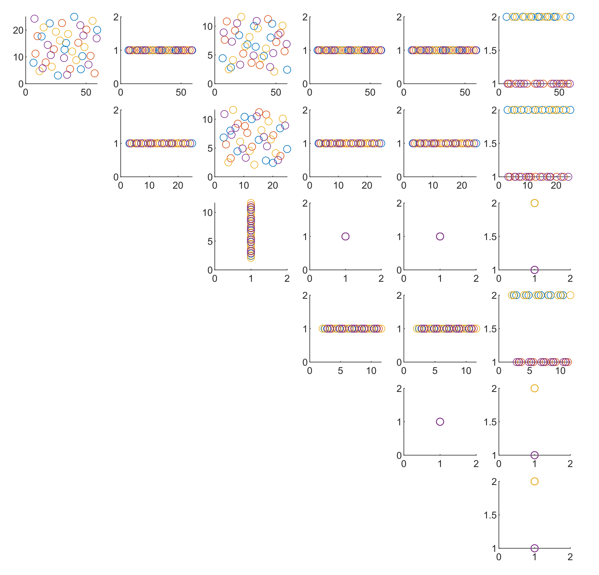

# MixedDoE-MATLAB


MixedDoE-MATLAB is a program that creates a Design of (computer) Experiments (DoE) for cobination of discrete and/or continuous variables in Matlab. The descrete part is composed either of full factorial or Taguchi-type Orthogonal array desings. For each point in a descrete part, a sliced design (Qian, 2015) is created for continuous variables. In this way, the continuous domain is uniformly covered but still, for different discrete poits the continuous part is not overlapping. Two procedures for contonuous part are available - either Halton sequence, or the classical LHS design. In the same way, the possibility of testing data generation is available. 




For educational and research purposes, license for using StableTrussOpt-MATLAB is free of charge.
For commercial purposes, please contact program developers.


Copyright (C) 2024 Matěj Lepš, Anna Kučerová

### Pre-requisites

In addition to Matlab it is essential to have a code for Least common multiple and regular Orthogonal array codes. Both algorihms found on internet are provided. This way, I would like to deeply thank their authors for providing them to the public. 

## Running StableTrussOpt-MATLAB
Just very small test example
```
>> main 
```

Your design using JSON file, inspect examples for syntax
```
>> main 'JSONfile.json'
```
## Documentation
Documentation/user manual is available [here](.pdf).


## References
Peter Z. G. Qian,  Sliced Latin Hypercube Designs, <i>Journal of the American Statistical Association</i>, <b>107</b>:497, 393-399 (2012). DOI: https://doi.org/10.1080/01621459.2011.644132


## Authors
[Matěj Lepš](mailto:matej.leps@fsv.cvut.cz) <br/>
[Anna Kučerová](mailto:anna.kucerova@cvut.cz) <br/>

## Acknowledgments
Financial support for this work was provided by the Technology Agency of the Czech Republic (TAČR), project number FW04020163 (Extension of the HiStruct platform by optimisation of global stability and analysis of design
combinations).